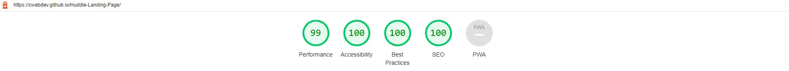

# Huddle Landing Page (PSD to HTML)

This is a solution to the [Huddle landing page with single introductory section challenge on Frontend Mentor](https://www.frontendmentor.io/challenges/huddle-landing-page-with-a-single-introductory-section-B_2Wvxgi0)

Live Site Link: https://cwebdev.github.io/Huddle-Landing-Page/

## Table of contents

- [Overview](#overview)
  - [Description](#description)
  - [Screenshot](#screenshot)
  - [Links](#links)
- [My process](#my-process)
  - [Built with](#built-with)  
- [Author](#author)

## Overview

A huddle community product landing page (responsive website) developed from PSD using HTML, CSS and JavaScript.

### Description

This landing page of Huddle product is developed in HTML5, CSS3 and JavaScript from PSD design. Page is responsive in web and mobile screens. Site performs very well in Google lighthouse performance metrics.

### Lighthouse Screenshot

### Desktop Screenshot

#### Mobile Screenshot

### Links

## My process

### Built with

- Semantic HTML5 markup
- CSS Flexbox
- Mobile-first workflow

## Author

- Website - [Chitrang Shah](https://chitrang.webflow.io/)
- Frontend Mentor Profile - [@cwebdev](https://www.frontendmentor.io/profile/cwebdev)